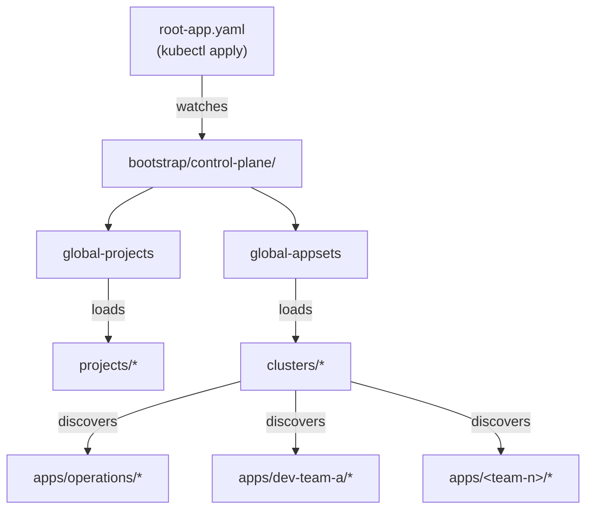

# DevSecOps ArgoCD Manifests

This repository contains the GitOps manifests for the DevSecOps platform, managed by ArgoCD. It follows an **App-of-Apps** pattern where a single root application bootstraps the entire platform.

## Bootstrapping ArgoCD

This section describes how to bootstrap ArgoCD so it manages all applications and platform components from this repository.

### Prerequisites

- A running Kubernetes cluster with ArgoCD installed in the `argocd` namespace
- `kubectl` configured with cluster access
- The ArgoCD repo (this repository) accessible from the cluster (public, or credentials configured in ArgoCD)

### Steps

**1. Apply the root application**

```bash
kubectl apply -f bootstrap/root-app.yaml
```

This single command kicks off the entire App-of-Apps chain. The `root-app` watches `bootstrap/control-plane/` and automatically deploys:

- **`global-projects`** — loads all ArgoCD `AppProject` definitions from `projects/`
- **`global-appsets`** — loads all `ApplicationSet` definitions from `clusters/`

Those ApplicationSets in turn discover and deploy every application under `apps/`.

**2. Verify the bootstrap**

Port-forward to the ArgoCD UI:

```bash
kubectl port-forward service/argocd-server -n argocd 8080:443
```

Then open [https://localhost:8080](https://localhost:8080) and confirm the following applications are synced and healthy:

| Application | Purpose |
|---|---|
| `root-app` | Top-level bootstrap app |
| `global-projects` | ArgoCD Project definitions |
| `global-appsets` | ApplicationSet definitions |

You can also verify from the CLI:

```bash
# Get the initial admin password
kubectl -n argocd get secret argocd-initial-admin-secret -o jsonpath="{.data.password}" | base64 -d

# List all ArgoCD applications
kubectl get applications -n argocd
```

### Architecture — App-of-Apps Pattern



> [!IMPORTANT]
> The `root-app` is the **only** manifest you apply manually. Everything else is managed by ArgoCD through Git.

## Directory Structure

*   **`bootstrap/`**: Contains the entry points for ArgoCD.
    *   **`root-app.yaml`**: The root Application that bootstraps the Control Plane. Pointer: `bootstrap/control-plane`.
    *   **`control-plane/`**: "Meta-Apps" that manage the platform configuration.
        *   `projects.yaml`: Loads ArgoCD Projects from `projects/`.
        *   `appsets.yaml`: Loads ApplicationSets from `clusters/`.
*   **`clusters/`**: Contains ApplicationSets. Each file here represents a Team or a Category of applications (e.g., `operations.yaml`, `dev-team-a.yaml`).
*   **`projects/`**: ArgoCD Project definitions (e.g., `operations-project.yaml`).
*   **`apps/`**: The actual application manifests. Organized by team/tenant.
    *   **`operations/`**: Operational tools (e.g., Kyverno).
    *   **`dev-team-a/`**: Applications belonging to Dev Team A.

## Workflows

### Onboarding a New Team
1.  Create a Project file in `projects/<team-name>-project.yaml`.
2.  Create an ApplicationSet in `clusters/<team-name>.yaml` targeting `apps/<team-name>/*`.

### Adding a New Application
1.  Create a new directory in `apps/<team-name>/<app-name>`.
2.  Add a `base/kustomization.yaml` (and overlays if needed).
3.  The ApplicationSet in `clusters/` will automatically detect and deploy it.

### Operations Apps
Operations applications (like Kyverno) are located in `apps/operations`. They are automatically deployed by the `clusters/operations.yaml` ApplicationSet.